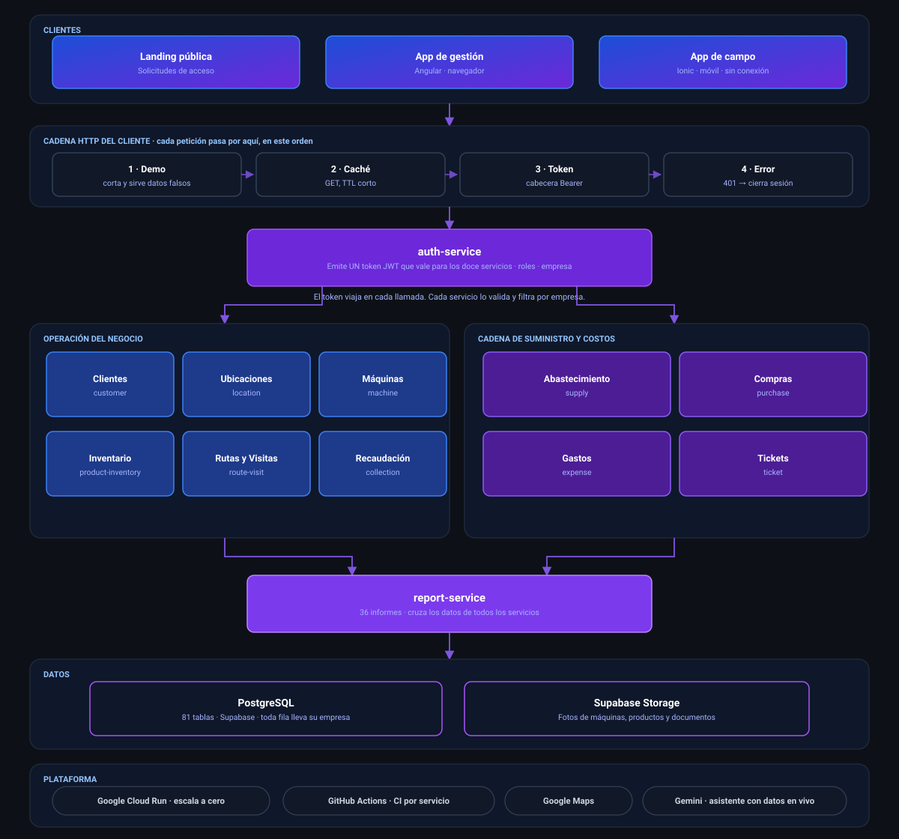
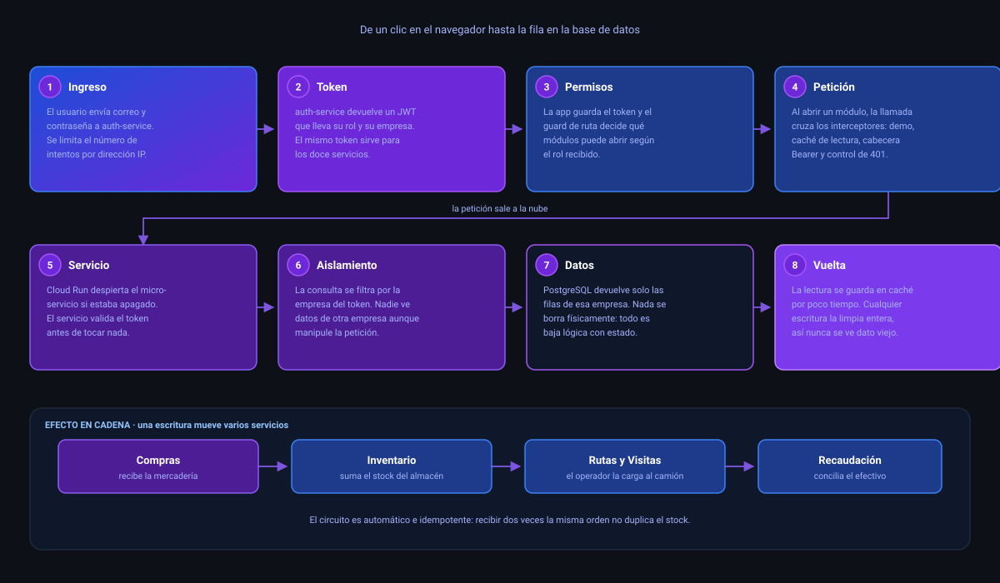
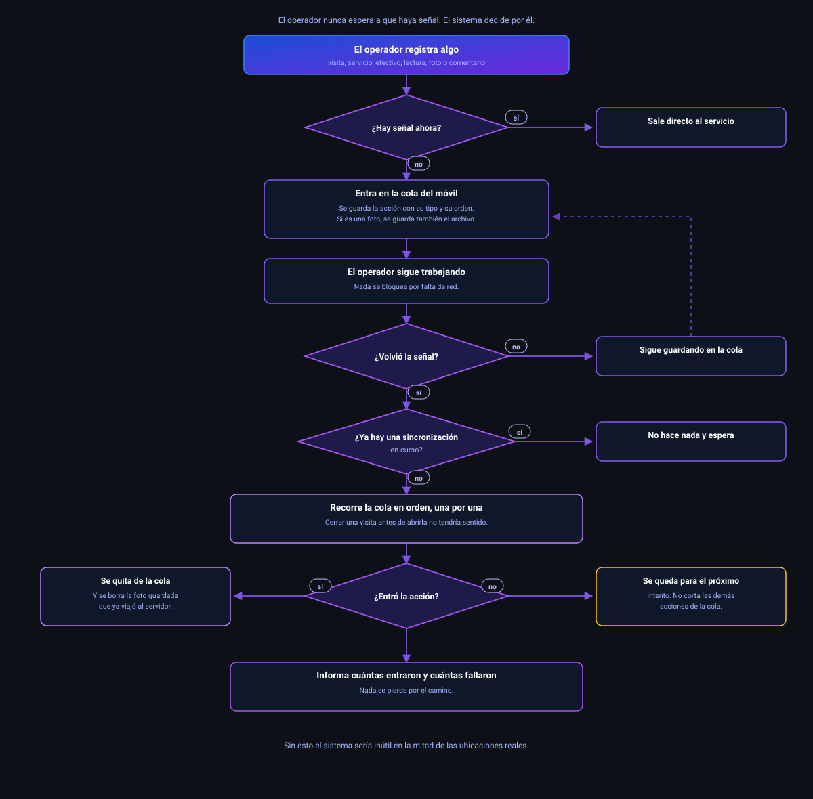

<b>Plataforma de gestión para empresas que operan máquinas expendedoras.</b> 
Diseñada, construida y desplegada de extremo a extremo por
<a href="https://github.com/manuel15963">Adolfo Berrocal</a>.

📌 Este repositorio es una <b>vitrina técnica</b>. Documenta la arquitectura y las decisiones de
diseño del sistema. El código fuente vive en repositorios privados.

---

## El problema

Una empresa de vending gestiona cientos de máquinas repartidas por distintas ubicaciones. Cada máquina
tiene su propio inventario, recauda dinero en efectivo, se queda sin stock en momentos distintos y
necesita mantenimiento. El operador de campo recorre rutas visitando máquinas, muchas veces en sótanos
o zonas industriales **sin señal de datos**.

La gestión típica de este negocio se hace en cuadernos y hojas de cálculo. El resultado es inventario
que no cuadra, máquinas vacías que nadie detectó y dinero recaudado que no se concilia contra lo
vendido.

## La solución

Un sistema que cubre el ciclo completo del negocio: desde la compra al proveedor hasta la
conciliación del efectivo recaudado en cada máquina, pasando por el abastecimiento, las rutas de
visita y la rentabilidad por ubicación.

Está construido como una plataforma **multiempresa**: varias empresas de vending operan sobre la
misma instalación, con sus datos completamente aislados unos de otros.

---

## Arquitectura

Cada servicio es una aplicación **Spring Boot** independiente, con su propio ciclo de vida, sus
pruebas y su despliegue en **Google Cloud Run**. Escalan a cero cuando no reciben tráfico, lo que
mantiene el costo de operación cercano a cero en periodos de baja actividad.

### Los doce servicios

| Servicio | Responsabilidad |
|---|---|
| **Autenticación** | Identidad, emisión y validación de JWT, roles y permisos, aislamiento por empresa |
| **Clientes** | Empresas y personas de contacto asociadas a las ubicaciones |
| **Ubicaciones** | Sitios físicos donde vive cada máquina, con geolocalización y frecuencia de servicio |
| **Máquinas** | Parque de máquinas, tipo, planogramas, mantenimiento, medios de pago |
| **Inventario** | Catálogo de productos, stock por máquina y almacén, productos compuestos y recetas |
| **Rutas y Visitas** | Planificación de rutas, visitas de servicio, kilometraje, optimización de recorrido |
| **Recaudación** | Conteo de efectivo por máquina, conciliación contra ventas, cierre contable del viaje |
| **Reportes** | Motor de 36 informes cruzando datos de todos los servicios |
| **Tickets** | Incidencias y averías reportadas desde campo |
| **Abastecimiento** | Proveedores, almacenes y vehículos |
| **Compras** | Órdenes de compra y recepción de mercadería, que alimenta el stock automáticamente |
| **Gastos** | Costos operativos, base del cálculo de rentabilidad |

---

## De extremo a extremo: la aplicación web

El recorrido completo de un clic en el navegador hasta la fila en la base de datos, y lo que ese
clic desencadena en el resto del sistema.

El detalle que sostiene todo lo demás está en el paso dos: **auth-service emite un solo token** que
lleva dentro el rol del usuario y su empresa, y ese mismo token vale para los doce servicios. Ninguno
guarda sesión. Cada uno valida la firma y filtra por empresa antes de tocar la base de datos, así que
el aislamiento entre empresas no depende de que el frontend se porte bien.

---

## De extremo a extremo: la app de campo

El operador recorre ubicaciones que muchas veces están en sótanos, almacenes o zonas industriales.
**La app no asume que hay red en ningún momento.**

Antes de salir, el operador descarga su viaje: paradas, inventario de cada máquina, última lectura de
contador y los catálogos que va a necesitar. Todo eso queda guardado en el móvil.

Durante la ruta cada gesto se convierte en una **acción tipada** que entra en una cola durable en vez
de salir a la red: iniciar y cerrar visita, servicio de la máquina, conteo de efectivo, lectura de
contador, foto y comentario. La cola sobrevive a que se cierre la aplicación.

Cuando vuelve la señal, la app lo detecta sola y **reenvía la cola en el mismo orden en que ocurrió**,
porque cerrar una visita antes de haberla iniciado no tendría sentido. Al terminar informa cuántas
acciones se enviaron y cuántas fallaron, sin perder nada por el camino.

---

## Decisiones técnicas

**Microservicios en vez de un monolito.** Cada dominio del negocio evoluciona a ritmo distinto. La
recaudación cambia con la normativa contable; el inventario, con el catálogo de productos. Separarlos
permite desplegar uno sin arriesgar el resto, y cada uno tiene su propio pipeline de integración
continua.

**Multiempresa por aislamiento de datos.** Todas las tablas del sistema llevan el identificador de
empresa, y el token de acceso lo transporta en cada petición. Un usuario nunca puede leer datos de
otra empresa, aunque manipule los identificadores de la petición.

**App de campo que funciona sin señal.** El operador descarga su viaje antes de salir. Registra
visitas, lecturas de contador, recaudación y fotos aunque no tenga datos. Todo se guarda en una cola
durable local y se sincroniza en orden al reconectar. Sin esto, el sistema sería inútil en la mitad
de las ubicaciones reales.

**Cero borrado físico.** Ninguna entidad se elimina de la base de datos. Todo es baja lógica con
filtro por estado. En un sistema con trazabilidad contable, borrar una fila destruye el historial.

**Escala a cero.** Los servicios corren en contenedores que se apagan sin tráfico. El precio es un
arranque en frío ocasional, mitigado con una capa de caché de lectura.

---

## Más allá de la gestión

| | |
|---|---|
| 🗺️ **Optimización de rutas** | Reordena las paradas de un viaje para reducir el recorrido |
| 📉 **Pronóstico de agotamiento** | Estima cuántos días faltan para que una máquina se quede sin producto, según su ritmo de venta |
| 📦 **Preparación de pedidos** | Genera la lista de carga del vehículo antes de salir a ruta |
| 💰 **Rentabilidad real** | Cruza ingresos, compras y gastos para dar la utilidad por periodo y por ubicación |
| 🤖 **Asistente conversacional** | Responde preguntas sobre la operación usando los datos en vivo del sistema |
| 📊 **36 informes** | Ventas, inventario, movimientos, recaudación, impuestos y flujo de caja |

---

## Stack

**Backend** · Java 17 · Spring Boot · Spring Security · JWT · Maven
**Frontend** · Angular · Ionic · TypeScript
**Datos** · PostgreSQL sobre Supabase
**Infraestructura** · Google Cloud Run · Docker · GitHub Actions

---

## Seguridad

El sistema pasó por una revisión de seguridad propia que cerró, entre otros puntos, la limitación de
intentos de inicio de sesión por dirección IP, el acceso indebido a recursos de otro usuario, el
endurecimiento de los tokens de acceso y las cabeceras de protección del navegador.

---

¿Preguntas sobre la arquitectura? Escríbeme.

