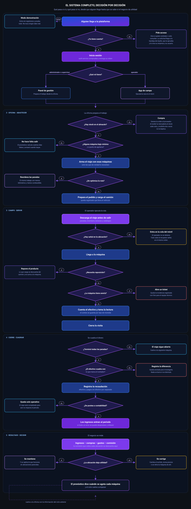
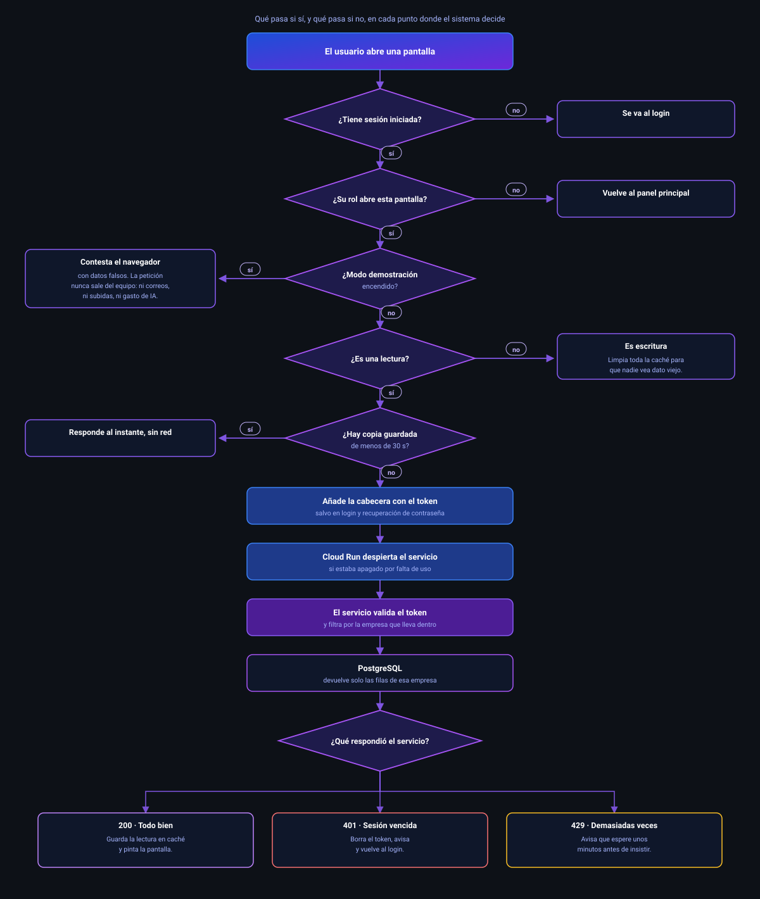

<b>Plataforma de gestión para empresas que operan máquinas expendedoras.</b> 
Diseñada, construida y desplegada de extremo a extremo por
<a href="https://github.com/manuel15963">Adolfo Berrocal</a>.

📌 Este repositorio es una <b>vitrina técnica</b>. Documenta la arquitectura y las decisiones de
diseño del sistema. El código fuente vive en repositorios privados.

---

## El problema

Una empresa de vending gestiona cientos de máquinas repartidas por distintas ubicaciones. Cada máquina
tiene su propio inventario, recauda dinero en efectivo, se queda sin stock en momentos distintos y
necesita mantenimiento. El operador de campo recorre rutas visitando máquinas, muchas veces en sótanos
o zonas industriales **sin señal de datos**.

La gestión típica de este negocio se hace en cuadernos y hojas de cálculo. El resultado es inventario
que no cuadra, máquinas vacías que nadie detectó y dinero recaudado que no se concilia contra lo
vendido.

## La solución

Un sistema que cubre el ciclo completo del negocio: desde la compra al proveedor hasta la
conciliación del efectivo recaudado en cada máquina, pasando por el abastecimiento, las rutas de
visita y la rentabilidad por ubicación.

Está construido como una plataforma **multiempresa**: varias empresas de vending operan sobre la
misma instalación, con sus datos completamente aislados unos de otros.

---

## Arquitectura

Cada servicio es una aplicación **Spring Boot** independiente, con su propio ciclo de vida, sus
pruebas y su despliegue en **Google Cloud Run**. Escalan a cero cuando no reciben tráfico, lo que
mantiene el costo de operación cercano a cero en periodos de baja actividad.

### Los doce servicios

| Servicio | Responsabilidad |
|---|---|
| **Autenticación** | Identidad, emisión y validación de JWT, roles y permisos, aislamiento por empresa |
| **Clientes** | Empresas y personas de contacto asociadas a las ubicaciones |
| **Ubicaciones** | Sitios físicos donde vive cada máquina, con geolocalización y frecuencia de servicio |
| **Máquinas** | Parque de máquinas, tipo, planogramas, mantenimiento, medios de pago |
| **Inventario** | Catálogo de productos, stock por máquina y almacén, productos compuestos y recetas |
| **Rutas y Visitas** | Planificación de rutas, visitas de servicio, kilometraje, optimización de recorrido |
| **Recaudación** | Conteo de efectivo por máquina, conciliación contra ventas, cierre contable del viaje |
| **Reportes** | Motor de 36 informes cruzando datos de todos los servicios |
| **Tickets** | Incidencias y averías reportadas desde campo |
| **Abastecimiento** | Proveedores, almacenes y vehículos |
| **Compras** | Órdenes de compra y recepción de mercadería, que alimenta el stock automáticamente |
| **Gastos** | Costos operativos, base del cálculo de rentabilidad |

---

## El sistema completo, decisión por decisión

Desde que alguien llega a la plataforma hasta que se sabe si una ubicación deja dinero. Cada rombo
es un punto donde el sistema decide, con lo que ocurre si la respuesta es sí y lo que ocurre si es no.

Pulsa la imagen para verla a tamaño completo.

El ciclo se cierra sobre sí mismo: lo que se aprende al medir la rentabilidad vuelve a la oficina y
cambia lo que se compra, a qué máquinas se va y qué producto se pone en cada una.

Vale la pena mirar tres bifurcaciones, porque son las que separan un sistema de gestión de una hoja
de cálculo:

**No se sale a la calle porque toque, se sale porque hace falta.** El viaje solo se arma con las
máquinas que están bajo mínimo o a punto de agotarse, y el pronóstico dice cuántos días faltan para
que cada una lo esté. Un recorrido menos es combustible, horas y desgaste que no se gastan.

**Si el efectivo no cuadra, se registra la diferencia.** No se ajusta el número para que encaje. El
conteo se compara contra lo que marca el contador de la máquina y el descuadre queda anotado para
investigarlo, que es justo el dato que un cuaderno nunca deja ver.

**Cerrar un viaje y contabilizarlo son dos cosas distintas.** Una visita puede estar terminada sin
haber impactado el periodo contable todavía, y si algo salió mal se puede despostear y rehacer sin
tocar el historial operativo.

---

## El camino de una petición

Cada vez que alguien toca un botón, la petición atraviesa una serie de puntos donde el sistema
**decide**. Este es el recorrido real, con lo que pasa si la respuesta es sí y lo que pasa si es no.

Tres de esas decisiones merecen explicación, porque son las que sostienen el resto del sistema.

**El modo demostración corta antes que nadie.** Va primero en la cadena a propósito. Mientras está
encendido, ninguna petición llega a salir del equipo: se responde ahí mismo con datos de ejemplo. Lo
que hace segura la demostración no es tener cuidado de no escribir en la base de datos, es que la
llamada nunca viaja. Tampoco se dispara un correo, ni una subida de imagen, ni consumo del asistente.

**La caché existe para tapar el arranque en frío.** Los servicios se apagan cuando nadie los usa, así
que la primera llamada del día tarda. Una lectura repetida dentro de los treinta segundos siguientes
se responde al instante sin tocar la red. Y cualquier escritura vacía la caché entera, de modo que
después de guardar algo nunca se ve el dato viejo.

**El token lleva dentro la empresa.** auth-service emite uno solo que vale para los doce servicios;
ninguno guarda sesión. Cada servicio valida la firma y filtra por esa empresa antes de tocar la base
de datos, así que el aislamiento entre empresas no depende de que el frontend se porte bien. Si el
token vence, la respuesta con código 401 borra la sesión y devuelve al login sin que nadie lo pida.

---

## El operador en campo, sin señal

El operador recorre ubicaciones que a menudo están en sótanos, almacenes o zonas industriales. **La
app no espera a que haya red en ningún momento**: decide sola qué hacer con cada gesto.

Antes de salir, el operador descarga su viaje: paradas, inventario de cada máquina, última lectura de
contador y los catálogos que va a necesitar. Todo queda guardado en el móvil.

Durante la ruta, si hay señal la acción sale directa; si no la hay, entra en una cola guardada en el
propio teléfono que sobrevive a que se cierre la aplicación. Cuando la señal vuelve, la app reenvía la
cola **en el mismo orden en que ocurrió**, porque cerrar una visita antes de haberla abierto no
tendría sentido.

El detalle que evita perder trabajo está en el último rombo: **una acción que falla no corta las
demás**. Se queda en la cola esperando el siguiente intento mientras el resto sigue subiendo, y al
final la app informa cuántas entraron y cuántas quedaron pendientes.

---

## Decisiones técnicas

**Microservicios en vez de un monolito.** Cada dominio del negocio evoluciona a ritmo distinto. La
recaudación cambia con la normativa contable; el inventario, con el catálogo de productos. Separarlos
permite desplegar uno sin arriesgar el resto, y cada uno tiene su propio pipeline de integración
continua.

**Multiempresa por aislamiento de datos.** Todas las tablas del sistema llevan el identificador de
empresa, y el token de acceso lo transporta en cada petición. Un usuario nunca puede leer datos de
otra empresa, aunque manipule los identificadores de la petición.

**App de campo que funciona sin señal.** El operador descarga su viaje antes de salir. Registra
visitas, lecturas de contador, recaudación y fotos aunque no tenga datos. Todo se guarda en una cola
durable local y se sincroniza en orden al reconectar. Sin esto, el sistema sería inútil en la mitad
de las ubicaciones reales.

**Cero borrado físico.** Ninguna entidad se elimina de la base de datos. Todo es baja lógica con
filtro por estado. En un sistema con trazabilidad contable, borrar una fila destruye el historial.

**Escala a cero.** Los servicios corren en contenedores que se apagan sin tráfico. El precio es un
arranque en frío ocasional, mitigado con una capa de caché de lectura.

---

## Más allá de la gestión

| | |
|---|---|
| 🗺️ **Optimización de rutas** | Reordena las paradas de un viaje para reducir el recorrido |
| 📉 **Pronóstico de agotamiento** | Estima cuántos días faltan para que una máquina se quede sin producto, según su ritmo de venta |
| 📦 **Preparación de pedidos** | Genera la lista de carga del vehículo antes de salir a ruta |
| 💰 **Rentabilidad real** | Cruza ingresos, compras y gastos para dar la utilidad por periodo y por ubicación |
| 🤖 **Asistente conversacional** | Responde preguntas sobre la operación usando los datos en vivo del sistema |
| 📊 **36 informes** | Ventas, inventario, movimientos, recaudación, impuestos y flujo de caja |

---

## Stack

**Backend** · Java 17 · Spring Boot · Spring Security · JWT · Maven
**Frontend** · Angular · Ionic · TypeScript
**Datos** · PostgreSQL sobre Supabase
**Infraestructura** · Google Cloud Run · Docker · GitHub Actions

---

## Seguridad

El sistema pasó por una revisión de seguridad propia que cerró, entre otros puntos, la limitación de
intentos de inicio de sesión por dirección IP, el acceso indebido a recursos de otro usuario, el
endurecimiento de los tokens de acceso y las cabeceras de protección del navegador.

---

¿Preguntas sobre la arquitectura? Escríbeme.

